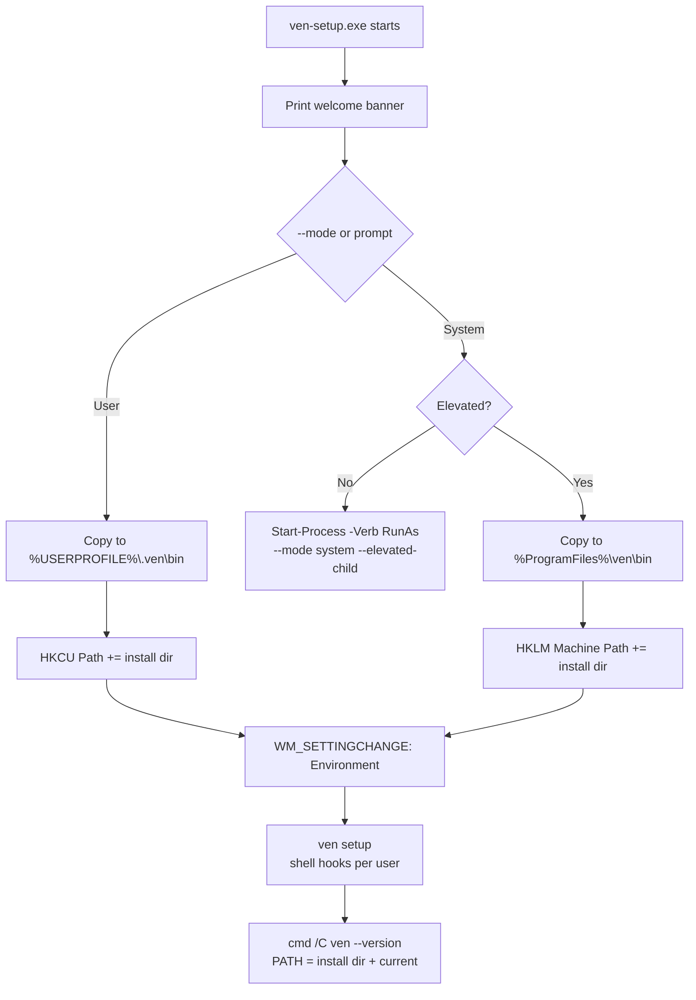

# `ven-setup` (Windows installer)

`ven-setup.exe` is the standalone Windows installer for `ven`. It copies `ven.exe` and `ven-launcher.exe` to a stable location, adds that directory to `PATH`, installs shell hooks, and verifies the install in a fresh process.

It is shipped alongside the release binaries; the installer itself is **not** required to use `ven-launcher.exe` (which works portably with no install).

## Modes

| Mode     | Install dir                        | PATH scope        | Admin? |
|----------|------------------------------------|-------------------|--------|
| **User**   | `%USERPROFILE%\.ven\bin`           | `HKCU\Environment\Path` (User)            | No  |
| **System** | `%ProgramFiles%\ven\bin`           | `HKLM\...\Session Manager\Environment\Path` (Machine) | Yes |

Both modes broadcast `WM_SETTINGCHANGE` so already-open Explorer/process trees pick up the new `PATH` without a sign-out.



## Usage

```powershell
# Interactive (default): pick 1 = User, 2 = System
ven-setup.exe

# Explicit modes
ven-setup.exe --mode user
ven-setup.exe --mode system

# CI / automation — no prompts; --mode is required
ven-setup.exe --mode user --no-input

# Show actions without touching the system
ven-setup.exe --mode user --dry-run
ven-setup.exe --mode system --dry-run   # never triggers UAC
```

## Options

| Flag                 | Description |
|----------------------|-------------|
| `--mode <user\|system>` | Install scope. Omit for interactive prompt. |
| `--dry-run`          | Print every step without copying, writing the registry, broadcasting, running `ven setup`, or verifying. |
| `--no-input`         | Disable the interactive prompt; `--mode` becomes required. |
| `--elevated-child`   | Internal flag set on the UAC-relaunched child. Hidden from `--help`; never set manually. |

## UAC behavior (System mode)

1. If System mode is selected and the current process is **not** elevated, `ven-setup.exe` re-spawns itself with `Start-Process -Verb RunAs --mode system --elevated-child` and exits 0 in the original window.
2. The elevated child window runs the full system install and pauses before closing so any errors stay on screen.
3. `--dry-run` never triggers UAC — system dry-runs are safe to inspect without admin.

The `--elevated-child` guard prevents an infinite UAC loop if elevation detection ever misfires.

## What gets changed

- **Files**: `ven.exe` and `ven-launcher.exe` are copied into the install dir. Existing files are overwritten.
- **Registry**: `[Environment]::SetEnvironmentVariable('Path', $new, <User|Machine>)` is used instead of writing `REG_MULTI_SZ` directly, which avoids the classic `REG_SZ` corruption pitfall.
- **Shell hooks**: `ven.exe setup` is executed from the install dir to install per-user shell hooks for the invoking user (see [`setup.md`](setup.md)). System mode does **not** modify system-wide shell rc files.
- **Verification**: `cmd /C ven --version` is run with `PATH = <install_dir>;%PATH%` so the check works without waiting for the broadcast to reach this process tree.

## Open a new terminal

The broadcast updates already-running shells in most cases, but reliably-correct behavior is to **open a new terminal** after install and run `ven --version`.

## See also

- [`ven setup`](setup.md) — shell hook installation (called by `ven-setup` after PATH update)
- [`ven-launcher`](../ven-launcher.md) — portable terminal spawner, no install required
