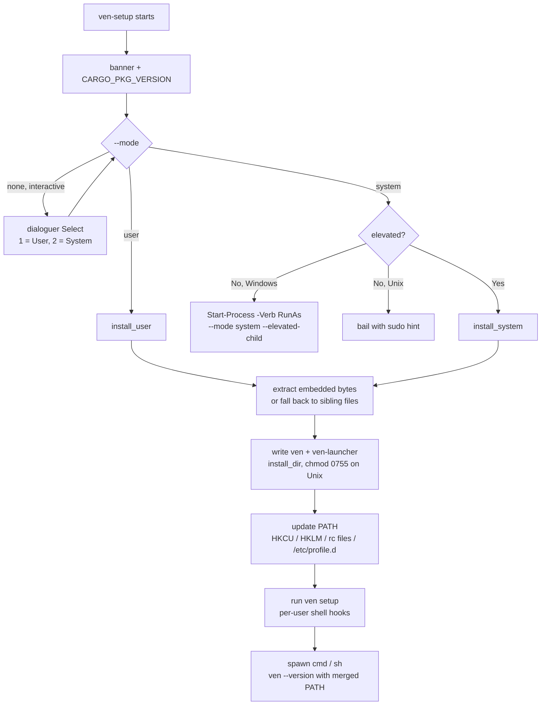

# `ven-setup` (cross-platform installer)

`ven-setup` is a **single self-contained installer**. `ven.exe` (`ven`) and `ven-launcher.exe` (`ven-launcher`) are **embedded as bytes** inside `ven-setup` at build time; the installer extracts them at install time, updates `PATH`, installs shell hooks, and verifies `ven --version`.

The installer also falls back to **sibling files on disk** when an embedded payload is empty, so development builds and `cargo run --bin ven-setup` still work.

## Install modes

### Windows

| Mode      | Install dir                  | PATH scope                                                   | Admin? |
|-----------|------------------------------|--------------------------------------------------------------|--------|
| `user`    | `%USERPROFILE%\.ven\bin`     | `HKCU\Environment\Path`                                      | No     |
| `system`  | `%ProgramFiles%\ven\bin`     | `HKLM\...\Session Manager\Environment\Path` (Machine)        | Yes (UAC) |

Both broadcast `WM_SETTINGCHANGE` so already-open shells pick up the new `PATH` without sign-out. System mode relaunches itself via `Start-Process -Verb RunAs --mode system --elevated-child` and the elevated console pauses before closing.

### Unix (Linux / macOS)

| Mode      | Install dir         | PATH wiring                                                | Root? |
|-----------|---------------------|------------------------------------------------------------|-------|
| `user`    | `~/.ven/bin`        | Block appended to `~/.bashrc` / `~/.zshrc` (or new `~/.profile`) | No  |
| `system`  | `/usr/local/bin`    | `/etc/profile.d/ven.sh` (idempotent PATH guard)             | Yes (`sudo`) |

There is no UAC equivalent on Unix; `--mode system` without `sudo` refuses to proceed and prints the exact re-invocation hint:

```text
System install requires root. Re-run with:
    sudo /path/to/ven-setup --mode system
```

The PATH block written to user rc files is delimited so it can be removed cleanly:

```bash
# >>> ven-setup PATH >>>
export PATH="/home/you/.ven/bin:$PATH"
# <<< ven-setup PATH <<<
```

## Flow



## Usage

```bash
# Interactive (default): 1 = User, 2 = System
ven-setup

# Explicit
ven-setup --mode user
ven-setup --mode system           # Windows: UAC. Unix: requires sudo.

# CI / automation
ven-setup --mode user --no-input
ven-setup --mode user --dry-run
ven-setup --mode system --dry-run # Windows: never triggers UAC. Unix: never requires sudo.
```

## Options

| Flag                    | Description                                                                                   |
|-------------------------|-----------------------------------------------------------------------------------------------|
| `--mode <user\|system>` | Install scope. Omit for the interactive prompt.                                               |
| `--dry-run`             | Print every step without writing files, modifying the registry / rc files, running children. |
| `--no-input`            | Disable the interactive prompt; `--mode` becomes required.                                    |
| `--elevated-child`      | Internal flag set on the Windows UAC-relaunched child. Hidden; never set manually.            |

## Binary embedding

`build.rs` copies `target/<profile>/ven[.exe]` and `target/<profile>/ven-launcher[.exe]` into `OUT_DIR/ven.bin` and `OUT_DIR/ven-launcher.bin`. `src/bin/setup/common.rs` then embeds them with:

```rust
pub const VEN_EMBEDDED: &[u8] = include_bytes!(concat!(env!("OUT_DIR"), "/ven.bin"));
pub const LAUNCHER_EMBEDDED: &[u8] = include_bytes!(concat!(env!("OUT_DIR"), "/ven-launcher.bin"));
```

At install time `resolve_binary_bytes` prefers the embedded payload and falls back to a sibling file on disk if the payload is empty (development case).

### Release build (canonical two-pass)

Cargo build scripts run **once, before any binary in the package compiles**, so on the first build the embedded payloads are empty stubs. The standard release flow is:

```bash
cargo build --release --bin ven --bin ven-launcher
cargo build --release --bin ven-setup
```

The second pass re-runs `build.rs` (via `cargo:rerun-if-changed`), picks up the freshly-built artifacts, and produces a fully self-contained `ven-setup[.exe]`. A single `cargo build --release` followed by another `cargo build --release` works as well.

You can verify the payload is non-empty by checking the output:

```text
[1/4] Extracting and writing binaries
  [OK] Installed to C:\Users\you\.ven\bin (ven 4192768 B + launcher 286720 B)
```

If both numbers print as `0`, run the release command again.

## What gets changed on disk

- **Files**: `ven[.exe]` and `ven-launcher[.exe]` written into the install dir (overwriting any existing files). On Unix the files are marked `0o755`.
- **Windows registry**: `[Environment]::SetEnvironmentVariable('Path', $new, <User|Machine>)` rather than direct `RegSetValueEx` writes, which avoids the classic `REG_SZ` vs `REG_EXPAND_SZ` corruption pitfall. `WM_SETTINGCHANGE` is broadcast via `SendMessageTimeout`.
- **Unix rc files**: a delimited block in `~/.bashrc` / `~/.zshrc` / `~/.profile` appends the install dir to `PATH`. The block is idempotent (skipped if `# >>> ven-setup PATH >>>` is already present).
- **Unix system PATH**: `/etc/profile.d/ven.sh` (`0755`) guards against duplicate entries with a `case` check.
- **Shell hooks**: the freshly-installed `ven` is invoked as `ven setup` to install per-user hooks (see [`setup.md`](setup.md)). System install on Unix **skips** per-user hooks and prints a hint to run `ven setup` from each user account.
- **Verification**: spawned `cmd /C ven --version` (Windows) or `sh -c 'ven --version'` (Unix) with `PATH = <install_dir> + current PATH` so the check works without waiting for the broadcast / new shell.

## Open a new terminal

Even with the broadcast and merged-PATH verification, the reliable behavior is to **open a new terminal** after install and run `ven --version`.

## See also

- [`ven setup`](setup.md) — shell hook installation (called by `ven-setup` after PATH update)
- [`ven-launcher`](../ven-launcher.md) — portable terminal spawner, no install required
